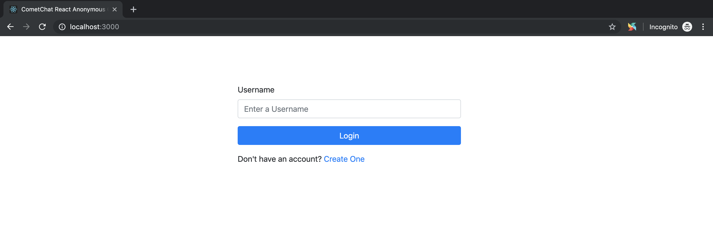
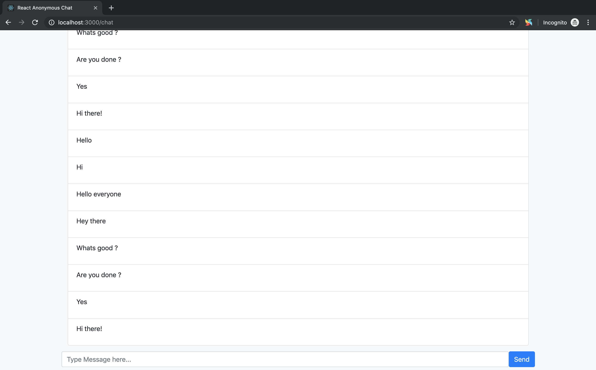

# React Anonymous Chat

In this demo app, we're going to build a realtime group chat using [React.js](https://reactjs.org/) and [CometChat](https://cometchat.com) that lets users chat without revealing their identities.

### Screenshots

### Technologies

This demo app uses the following:
 - [CometChat Pro](https://cometchat.com)
 - [React.js](https://reactjs.org/)
 - [React Bootstrap ](https://react-bootstrap.github.io/)

### Running the demo application

In order to run the demo application locally, you'll need to follow the following steps:

- Create an account with [CometChat Pro](https://cometchat.com)
- Head over to the [CometChat Pro Dashboard](https://app.cometchat.com/#/apps), create a new app called **React Anonymous Chat** and click **Explore**
- Go to the **API Keys** tab and click **Create API Key** 
- Create an API Key called **React Anonymous Chat** with **Full Access**.
- Clone the repository by running `git clone https://github.com/KingIdee/cometchat-react-anonymous-chat.git` in the terminal and open it with the code editor of your choice.
- Open the  `.env` file and add keys from your CometChat app.
- `cd` into the project folder and run `npm install` to install dependencies
- Run your app using `npm start`
- Open your browser on `http://localhost:3000` to see the app
- Use any of the default usernames **SUPERHERO1**, **SUPERHERO2**, **SUPERHERO3**, **SUPERHERO4**, **SUPERHERO5** to login and start chatting.

### Useful Links

- [CometChat Pro JavaScript SDK Documentation](https://prodocs.cometchat.com/docs/js-quick-start)
- [CometChat Pro Dashboard](https://app.cometchat.com/#/apps)

